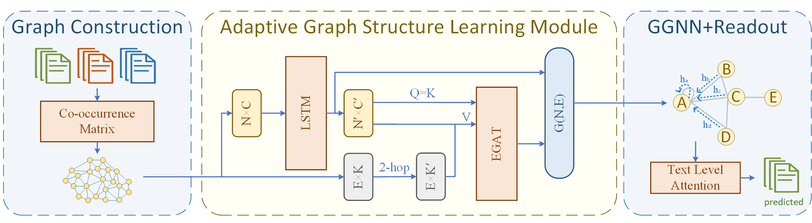

# AutoGAT
AutoGAT: Text Classification via Adaptive Graph Learning

## Introduction

Inspired by the paper TextING (ACL2020), exploring the use of graph structures to reconstruct the topological relationships between words in documents, we propose a graph structure adaptive updating, inductive document classification.
  
LSTM is introduced to learn the sequence information of text to make up for the lack of using only GloVe for word embedding; a learnable graph structure learning module is designed to fuse the attention mechanism to update the graph structure in the k-hop range; the original binarized adjacency matrix is improved to an edge relation that carries high-dimensional feature information, and a graph self-attention module fusing the edge information is designed to aggregate the neighbor information. The ablation experiments proved the necessity of the above modules, which were finally realized on the MR dataset where the effect of TextING was most significantly improved, and the accuracy was improved by 2.35% compared to TextING.

## Requirements
- Python 3.6/3.7
- Pytorch 1.7.1/1.13.1
- Scipy 1.5.1/1.7.3

If there are any issues with the environment configuration, you can consult the two different runtime environments we exported using conda, located at  `/environment_config `. In these environment, some packages may not be necessary for this code. This information can serve as a reference when configuring the environment.

We recommend utilizing the cuda11.7 environment configuration, as it is better suited for our upcoming KAN version's required environment.

Other versions may also work, the package version is not very demanding, but please note that the version of CUDA is compatible with the version of packages such as [PyTorch](https://pytorch.org), [dgl](https://www.dgl.ai/pages/start.html), etc.
## Usage
*1.* Download pre-trained word embeddings:GloVe.

Download pre-trained word embeddings `glove.6B.300d.txt` from [here](http://nlp.stanford.edu/data/glove.6B.zip) and unzip to the repository.

*2.* To build the text graph.
Build text graph from the datasets in data/corpus/ as:
```python
python build_graph.py [DATASET] [WINSIZE]
```
Provided datasets include `mr`,`ohsumed`,`R8`and`R52`. The default sliding window size is 3.
To use your own dataset, put the text file under `data/corpus/` and the label file under `data/` as other datasets do. Preprocess the text by running `remove_words.py` before building the graphs.
Start training and inference as:
```python
python train.py [--dataset DATASET] [--name value]
```
Examples:
```python
python build_graph.py --dataset R8
python train.py --dataset R8
```

## Acknowledgement

The data preprocess and graph construction are from [TextGCN](https://github.com/yao8839836/text_gcn)